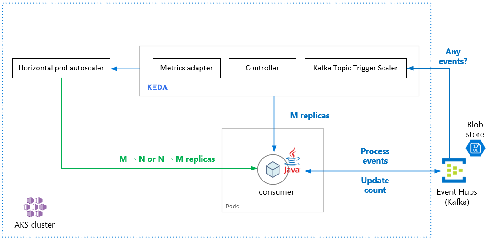

# Autoscaling Java applications with KEDA using Azure Event Hubs

This is a quickstart for **Kafka trigger scaler** using **Azure Event Hubs with Kafka head** to scale **Java applications** deployed on **AKS** which consume messages from Azure Event Hub.

## Key Concepts

[KEDA](https://keda.sh) is a Kubernetes-based Event Driven Autoscaler. KEDA determines how any container within Kubernetes should be scaled based on the number of events that need to be processed. KEDA, which has a variety of out-of-the-box scalers, supports multiple types of workloads, supports Azure Functions, and is vendor-agnostic.



The application that needs to be scaled out automatically based on incoming message count is deployed on the AKS cluster. A Kafka scaler is used in this sample to detect if deployment should be activated or deactivated and to feed custom metrics for a specific event source. The event source in this example is an Azure Event Hub.

When the number of messages in the Azure Event Hub exceed a threshold (set to 50 in the sample by default), KEDA triggers the pods to scale out thus increasing the number of messages processed by the application. Automatic scale down of the pods occurs when the number of messages in the event source falls below the threshold value.

This pattern can be successfully implemented in Microservices architectures which are event driven.

This sample uses terraform to deploy the required resources.

## Repository structure

| Folder        | Description                                    |
|---------------|------------------------------------------------|
| deploy        | YAML files for deploying application           |
| docs          | Documentation and images                       |
| microservices | Application code and Docker images             |
| terraform     | Terraform template for infrastructure creation |

## Resources created

The infrastructure provisioned by Terraform by default includes:

* 1 Resource Group
* 1 Azure Container Registry
* 3 node Azure Kubernetes Cluster with KEDA
* 1 Azure Event Hub Namespace with autoscale enabled throughput
* 1 Azure Event Hub with a Consumer Group

## Prerequisites

We will be deploying to Azure, so you will need an Azure account. If you don't have an account,
[sign up for free here](https://azure.microsoft.com/en-us/free/).

* [Terraform](https://learn.hashicorp.com/terraform/getting-started/install.html)
* [Azure CLI](https://docs.microsoft.com/en-us/cli/azure/install-azure-cli?view=azure-cli-latest)
* [Service Principal](https://docs.microsoft.com/en-us/cli/azure/create-an-azure-service-principal-azure-cli?view=azure-cli-latest)
* [Helm](https://helm.sh/docs/intro/install/)

# Getting Started

## 1. Clone the repository

Either fork or clone this repo into your local machine

```bash
git clone https://github.com/Azure-Samples/keda-eventhub-kafka-scaler-terraform.git

cd keda-eventhub-kafka-scaler-terraform
```
## 2. Making sure you have the right Azure subscription selected

If you don't know the subscription ID, you can run the following command through Azure CLI:

```sh
# Login to Azure
az login 

# Shows current Azure subscription
az account show

# Lists all available Azure subscriptions
az account list

# Sets Azure subscription to desired subscription using ID
az account set <subscription_id>
```

It is expected to get the a similar response on running `az account show` :

```sh
{
  "environmentName": "AzureCloud",
  "id": "<subscription id>",
  "isDefault": true,
  "name": "<subscription name>",
  "state": "Enabled",
  "tenantId": "<tenant id>",
  ...
}
```

Verify that you are logged into the right Azure subscription.

## 3. Creating or reusing a service principal

Azure service principal is an identity created for use with applications, hosted services, and automated tools to access Azure resources. This access is restricted by the roles assigned to the service principal, giving you control over which resources can be accessed and at which level. 

Terraform requires a service principal to authenticate to Azure. You can use an existing service principal or create a new one through Azure CLI or Azure Portal.

You can follow the steps described [here](https://www.terraform.io/docs/providers/azurerm/guides/service_principal_client_secret.html#creating-a-service-principal-using-the-azure-cli) to create a service principal using the Azure CLI. Make sure you copied the `appId` and `password` properties. In the next steps, they will be used as `CLIENT_ID` and `CLIENT_SECRET` respectively. 

## 4. Deploying resources using terraform

Edit the `variables.tf` file to change the default variables for any resources that you want to modify. You may change the location of resource deployment, the number of AKS nodes or even the default Event Hub capacity.
The current defaults will also work.

Go to the terraform directory of the repo

```bash
cd keda-eventhub-kafka-scaler-terraform\terraform

# Initialize terraform
terraform init

# Create terraform plan
# Enter the Client ID and Client Secret as referenced in previous step when prompted
terraform plan

# Apply terraform
# Enter the Client ID and Client Secret as referenced in previous step when prompted
terraform apply
```

This will create resources as listed in the [Resources section](#resources-created)

Expected output:
```bash
Apply complete! Resources: 4 added, 0 changed, 0 destroyed.

Outputs:

acr_name = kedaehacr
admin_password = <sensitive>
admin_username = kedaehacr
client_certificate = <sensitive>
client_key = <sensitive>
cluster_ca_certificate = <sensitive>
cluster_password = <sensitive>
cluster_username = clusterUser_keda-rg_keda-cluster
eventhub_consumergroup_name = group-receiver-topic
eventhub_consumergroup_name_base64encoded = Z3JvdXAtcmVjZWl2ZXItdG9waWM=
eventhub_name = receiver_topic
eventhub_name_base64encoded = cmVjZWl2ZXJfdG9waWM=
eventhub_namespace_conn_string = kjnfaslnfow89ykjnf
eventhub_namespace_name = kedaeh-hubns-dev
eventhub_namespace_name_base64encoded = a2VkYWVoLWh1Ym5zLWRldg==
resource_group_name = keda-rg
aks_cluster_name = keda-cluster
host = <redacted>
kube_config = <sensitive>
```

Make note of the following values:
```
acr_name
eventhub_consumergroup_name
eventhub_consumergroup_name_base64encoded
eventhub_name
eventhub_name_base64encoded
eventhub_namespace_conn_string_base64encoded
eventhub_namespace_name
eventhub_namespace_name_base64encoded
resource_group_name
aks_cluster_name
```

## 5. Store secrets in `deploy-kafka-secret.yaml`

Enter the base64 encoded Event Hub Connection String secret obtained from above value `eventhub_namespace_conn_string_base64encoded` in the `keda-eventhub-kafka-scaler-terraform\deploy\deploy-secret.yaml` file against the `password` field.

Enter the other base64 encoded values against the corresponding fields in the `keda-eventhub-kafka-scaler-terraform\deploy\deply-secret.yaml` file.

```yaml
password: "<eventhub_namespace_conn_string_base64encoded>"
eventhub_namespace: "<eventhub_namespace_name_base64encoded>"
consumer_group: "<eventhub_consumergroup_name_base64encoded>"
eventhub_name: "<eventhub_name_base64encoded>"
```

The other secrets in the `deploy-secret.yaml` are already filled in for you. The `sasl` is set to be base64 encoded string for `plaintext`, `tls` is set to be base64 encoded string for `enabled` and the `username` is set to be base64 encoded string for `$ConnectionString`.

```yaml
sasl: "cGxhaW50ZXh0="
tls: "ZW5hYmxl"
username: "JENvbm5lY3Rpb25TdHJpbmc="
```

## 6. Build and Dockerize JAVA application

The Java application can be built independently with running below command from the `microservices\consumer-kafka` directory of this repo

```bash
# Enter consumer-kafka directory
cd keda-eventhub-kafka-scaler-terraform\microservices\consumer-kafka

# Run mvn clean package
mvn clean package
```

Verify that the `Dockerfile` has the right path for target

```bash
# Create docker image for Java consumer application
docker build -t <enter_desired_tag_name> .
```

Upload docker image to ACR

Use the `acr_name` and `resource_group_name` obtained from terraform output above.

```bash
# Login to ACR
az acr login --name <acr_name>

# Get ACR server name
az acr list --resource-group <resource_group_name> --query "[].{acrLoginServer:loginServer}" --output table
>AcrLoginServer
------------------
<acr_name>.azurecr.io

# Tag docker image to created ACR
docker tag <image_tag> <acr_name>.azurecr.io/<image_tag>

# Publish docker image to created ACR
docker push <acr_name>.azurecr.io/<image_tag>
```

## 7. Update `deploy-kafka-scaler.yaml`

### Update deployment image details

Update the Deployment container spec with the image name obtained from previous step in the `keda-eventhub-kafka-scaler-terraform\deploy\deploy-kafka-scaler.yaml` file.

```yaml
    spec:
      containers:
      - name: kedaconsumer
        image: <acr_name>.azurecr.io/<image_tag>
        env:
```

### Update ScaledObject metadata

The Kafka trigger needs some metadata to make sure it is scaling the pods based on the right details. These details are provided as a part of metadata in the `ScaledObject` deployment yaml.

Open the `deploy-kafka-scaler.yaml` file and replace the `<eventhub_namespace_name>`, `<eventhub_consumergroup_name>` and `<eventhub_name>` with the actual values obtained from terraform output in plain text:

```yaml
    metadata:
      # Required
      bootstrapServers: <eventhub_namespace_name>.servicebus.windows.net:9093
      consumerGroup: <eventhub_consumergroup_name>
      topic: <eventhub_name>
      lagThreshold: "50"
```

## 8. Deploy secrets and application to AKS

```bash
# Deploy secrets
kubectl apply -f deploy-secret.yaml
> secret/keda-kafka-secrets created
```

Make sure that the image name and tag in the `deploy-kafka-scaler.yaml` file matches the docker image pushed to ACR in the previous section

```bash
# Deploy Java application as Deployment and ScaledObject details
kubectl apply -f deploy-kafka-scaler.yaml
> deployment.apps/kedaconsumer created
> triggerauthentication.keda.k8s.io/keda-trigger-auth-kafka-credential created
> scaledobject.keda.k8s.io/kafka-scaledobject created
```

Verify deployment

```bash
# Get kube.config
az aks get-credentials --name <aks_cluster_name> --resource-group <resource_group_name>

# Get pods -n keda
kubectl get pods
NAME                                              READY   STATUS    RESTARTS   AGE
keda-operator-779694695b-27jvr                     1/1     Running   0          72m
keda-operator-metrics-apiserver-5bcfc784f4-6dpzt   1/1     Running   0          72m

# Get deployment
# Since there are no messages in the Event Hub, the kedaconsumer has no pods allocated
kubectl get deployment
NAME                             READY   UP-TO-DATE   AVAILABLE   AGE
kedaconsumer                      0/0     0            0           19m
keda-operator                     1/1     1            1           73m
keda-operator-metrics-apiserver   1/1     1            1           73m

# Verify HPA is deployed
kubectl get hpa
NAME                    REFERENCE                 TARGETS              MINPODS   MAXPODS   REPLICAS   AGE
keda-hpa-kedaconsumer   Deployment/kedaconsumer   <unknown>/50 (avg)   1         100       0          117m
```

## 9. Sending messages to Event Hub to test pod autoscaling

For this, you can execute your own producer sending messages so that they exceed the lag threshold that was set in the `deply-kafka-scaler.yaml` file in order to see the pods scale up.

The producer sample given in the `microservices\producer-kafka` folder can also be used to send messages.

### Using given producer sample

#### Prerequisites

* [Java Development Kit (JDK) 1.7+](http://www.oracle.com/technetwork/java/javase/downloads/index.html)
    * On Ubuntu, run `apt-get install default-jdk` to install the JDK.
    * Be sure to set the JAVA_HOME environment variable to point to the folder where the JDK is installed.
* [Download](http://maven.apache.org/download.cgi) and [install](http://maven.apache.org/install.html) a Maven binary archive
    * On Ubuntu, you can run `apt-get install maven` to install Maven.

#### Update configs

Modify the `microservices/producer-kafka/src/main/resources/producer.config` file with the Event Hub namespace and Event Hub ConnectionString values:

```config
bootstrap.servers=<EVENTHUB_NAMESPACE>.servicebus.windows.net:9093
security.protocol=SASL_SSL
sasl.mechanism=PLAIN
sasl.jaas.config=org.apache.kafka.common.security.plain.PlainLoginModule required username="$ConnectionString" password="<EVENTHUB_CONNECTIONSTRING>";
```

Also make sure that the `<EVENTHUB_NAME>` is replaced with the right value in the `microservices/producer-kafka/src/main/java/TestProducer.java` file.

#### Run the producer

To run the producer from the command line, generate the JAR and then run from within Maven (alternatively, generate the JAR using Maven, then run in Java by adding the necessary Kafka JAR(s) to the classpath):

```bash
# Run these commands from the producer-kafka directory
mvn clean package
mvn exec:java -Dexec.mainClass="TestProducer"
```

The producer will now begin sending events to the Kafka-enabled Event Hub at topic you chose and printing the events to stdout.

## Expected outcome

Once you let the producer run for a couple of seconds, you should start seeing the HPA scale out the number of pods. Ideally, depending on the number of messages being sent,  the number of pods should not be greater than the number of partitions on the Event Hub.

```bash
# Get HPA 
kubectl get hpa -w
NAME                    REFERENCE                 TARGETS              MINPODS   MAXPODS   REPLICAS   AGE
keda-hpa-kedaconsumer   Deployment/kedaconsumer   <unknown>/50 (avg)   1         100       0          30m
keda-hpa-kedaconsumer   Deployment/kedaconsumer   <unknown>/50 (avg)   1         100       1          30m
keda-hpa-kedaconsumer   Deployment/kedaconsumer   236/50 (avg)         1         100       1          31m
keda-hpa-kedaconsumer   Deployment/kedaconsumer   50250m/50 (avg)      1         100       4          31m
keda-hpa-kedaconsumer   Deployment/kedaconsumer   40/50 (avg)          1         100       5          31m
keda-hpa-kedaconsumer   Deployment/kedaconsumer   25200m/50 (avg)      1         100       5          33m
keda-hpa-kedaconsumer   Deployment/kedaconsumer   42800m/50 (avg)      1         100       5          33m
keda-hpa-kedaconsumer   Deployment/kedaconsumer   40/50 (avg)          1         100       5          33m
keda-hpa-kedaconsumer   Deployment/kedaconsumer   0/50 (avg)           1         100       5          34m
keda-hpa-kedaconsumer   Deployment/kedaconsumer   <unknown>/50 (avg)   1         100       0          38m

# Get pods
kubectl get pods
NAME                             READY   STATUS    RESTARTS   AGE
kedaconsumer-57f88dc9c8-6stzx    1/1     Running   0          8s
kedaconsumer-57f88dc9c8-9fs5q    1/1     Running   0          7s
kedaconsumer-57f88dc9c8-jkt6f    1/1     Running   0          7s
kedaconsumer-57f88dc9c8-vtr5m    1/1     Running   0          7s
kedaconsumer-57f88dc9c8-hdw78    1/1     Running   0          7s
```

## Destroy Resources

The resources can be destroyed by running the following commands:

```bash
# Preview the terraform destroy output
terraform plan -destroy

# Destroy all the resources deployed for this sample. This will ask for confirmation before destroying, unless -auto-approve is set.
terraform destroy
```

## References

* [KEDA Concepts](https://keda.sh/docs/concepts/)
* [KEDA Apache Kafka Topic Scaler](https://keda.sh/docs/scalers/apache-kafka-topic/)

## Contributing

This project welcomes contributions and suggestions.  Most contributions require you to agree to a
Contributor License Agreement (CLA) declaring that you have the right to, and actually do, grant us
the rights to use your contribution. For details, visit https://cla.opensource.microsoft.com.

When you submit a pull request, a CLA bot will automatically determine whether you need to provide
a CLA and decorate the PR appropriately (e.g., status check, comment). Simply follow the instructions
provided by the bot. You will only need to do this once across all repos using our CLA.

This project has adopted the [Microsoft Open Source Code of Conduct](https://opensource.microsoft.com/codeofconduct/).
For more information see the [Code of Conduct FAQ](https://opensource.microsoft.com/codeofconduct/faq/) or
contact [opencode@microsoft.com](mailto:opencode@microsoft.com) with any additional questions or comments.